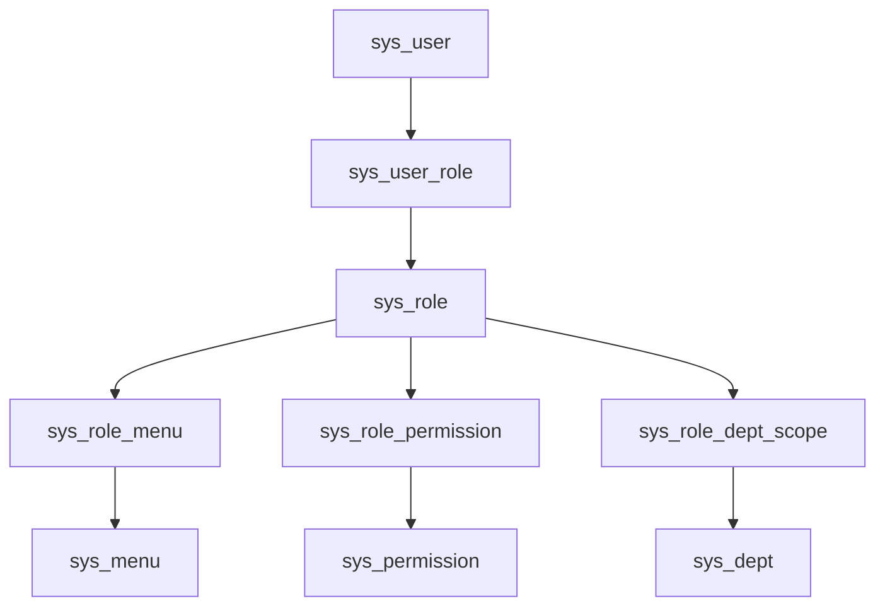

# RBAC 权限判定设计

## 1. 目标与范围

本文档用于将当前仓库中的 RBAC 草稿整理为可直接指导开发的一期设计，目标是完成管理端的基础权限闭环：

- 用户登录后能够初始化当前用户的角色、权限和菜单上下文
- `Sa-Token` 的 `@SaCheckRole`、`@SaCheckPermission` 可以真正生效
- 前端可以基于后端返回的菜单和权限码做菜单显隐、按钮显隐和接口调用控制
- 超级管理员可以走简单兜底逻辑，避免一期实现过度复杂

一期范围包含：

- 用户、角色、菜单、权限、数据范围的模型定义
- 登录态中的 RBAC 上下文初始化
- `StpInterfaceImpl` 的角色/权限查询实现
- 菜单可见性和接口/按钮权限控制
- 权限缓存与失效策略

一期暂不包含：

- 行级数据权限 SQL 自动拼接
- 字段级权限裁剪
- 多租户权限隔离的完整实现
- 前端路由渲染细节

---

## 2. 当前现状

结合当前代码与 SQL，RBAC 的“数据模型层”已具备基础形态，但“运行时判定层”尚未落地：

### 2.1 已具备的内容

- `sql/init/system.sql` 中已存在 RBAC 相关表：
  - `sys_role`
  - `sys_menu`
  - `sys_permission`
  - `sys_user_role`
  - `sys_role_menu`
  - `sys_role_permission`
  - `sys_role_dept_scope`
- `vita-service` 中已有上述表的 entity / dto / vo / service / controller 基础 CRUD 结构
- 认证链路已具备登录、登出、当前登录用户信息获取能力
- 登录态已通过 Sa-Token session 缓存基础用户快照

### 2.2 尚未完成的关键点

- `vita-service/src/main/java/com/vita/auth/StpInterfaceImpl.java` 需要通过 `IAuthCommonService` 接通角色与权限回调
- `vita-service/src/main/java/com/vita/auth/service/impl/AuthServiceImpl.java` 当前只缓存基础登录用户信息，没有初始化角色码、权限码、菜单数据
- 当前需要由 `IAuthCommonService` 统一承接 RBAC 聚合查询，避免角色、权限、菜单查询入口分散
- 当前 `GET /auth/info` 返回的是基础用户信息模型，不足以支撑前端权限初始化
- 数据范围模型已经有 `data_scope_type` 与 `sys_role_dept_scope`，但还没有真正参与查询判定

### 2.3 结论

当前仓库已经完成了 RBAC 的“静态结构搭建”，下一步应聚焦“运行时判定闭环”：

1. 能查出来
2. 能缓存起来
3. 能让 Sa-Token 用起来
4. 能让前端消费起来

---

## 3. 权限模型

### 3.1 核心关系



### 3.2 关键表职责

- `sys_user`
  - 用户基础信息
  - `status`：1 启用，0 禁用
  - `is_super_admin`：唯一超级管理员用户标记，也是运行时唯一判定来源
  - `is_system`：是否系统内置用户，仅用于运维保护，不直接决定权限
- `sys_role`
  - 角色编码 `role_code`
  - 数据范围类型 `data_scope_type`
- `sys_menu`
  - 用于菜单树、路由渲染、页面入口显隐
- `sys_permission`
  - 用于接口/按钮/动作权限控制
  - `permission_code` 与 `auth_tag` 是权限判定主键
- `sys_user_role`
  - 用户与角色关联
- `sys_role_menu`
  - 角色与菜单关联
- `sys_role_permission`
  - 角色与权限关联
- `sys_role_dept_scope`
  - 角色与自定义部门数据范围关联，仅在后续数据权限阶段参与

### 3.3 一期有效数据过滤规则

RBAC 查询应统一过滤以下条件：

- `status = 1`
- `is_deleted = 0`
- 关联表记录未逻辑删除
- 菜单、权限、角色按 `sort_no` 或 `role_sort` 进行稳定排序

若后续接入租户能力，再统一追加：

- `tenant_id = 当前租户`

---

## 4. 超级管理员判定规则

为避免一期设计过于复杂，超级管理员采用“简单兜底”策略。

### 4.1 判定优先级

判定规则只有一条：

1. 若 `sys_user.is_super_admin = 1`，直接视为超级管理员
2. 否则，按普通 RBAC 模型聚合角色、权限和菜单

### 4.2 超级管理员效果

超级管理员应具备以下特性：

- `getRoleList` 可以返回一个框架用的虚拟角色码 `SUPER_ADMIN`，不依赖角色表落库
- `getPermissionList` 返回 `["**:**:**"]`
- 菜单查询返回全部启用菜单
- 不需要依赖 `sys_role_permission` 和 `sys_role_menu` 中的配置完整性

### 4.3 `is_system` 的使用边界

`is_system` 不参与运行时鉴权，它只用于后台管理保护，例如：

- 系统内置角色不允许删除
- 系统内置菜单不允许随意停用
- 系统内置权限不允许直接改编码

---

## 5. 运行时模型设计

### 5.1 设计目标

运行时不应每次校验权限都重新走全量表关联查询，而应先构建当前登录用户的权限快照。数据库访问统一遵循“无 join、service 聚合”的约束。

### 5.2 建议的快照内容

建议将 RBAC 上下文拆成两层：

#### 基础登录用户快照

当前 `vita-common/src/main/java/com/vita/auth/model/LoginUserInfoModel.java` 继续保留，用于存放：

- 用户 ID
- 用户名
- 昵称
- 部门 ID
- 超级管理员标记
- 系统内置标记
- 登录终端信息

#### RBAC 权限快照

一期先不单独引入 RBAC 上下文模型，而是使用 Sa-Token Session 中的独立键存放：

- `LOGIN_USER_ROLE`
- `LOGIN_USER_PERMISSION`

设计原因：

- 基础登录信息和权限上下文生命周期不同
- 权限可能因角色分配变化而失效，需要单独刷新
- `StpInterfaceImpl` 只关心角色码和权限码，不应依赖前端菜单结构对象

### 5.3 `/auth/info` 返回对象

建议将当前 `/auth/info` 的返回升级为聚合型响应，例如 `AuthInfoVo`：

```json
{
  "userInfo": {
    "id": 1,
    "username": "admin",
    "nickName": "系统管理员",
    "deptId": 100,
    "isSuperAdmin": 1,
    "isSystem": 0
  },
  "roleCodes": [
    "SUPER_ADMIN",
    "SYSTEM_ADMIN"
  ],
  "permissionCodes": [
    "**:**:**"
  ],
  "menus": [
    {
      "id": 1000,
      "parentId": 0,
      "menuName": "系统管理",
      "routeName": "System",
      "routeLink": "/system"
    }
  ]
}
```

如果当前前端尚未联调，可以直接改造 `/auth/info`；若已存在兼容压力，则建议新增 `/auth/context`。

---

## 6. 权限判定流程

### 6.1 登录流程

`POST /auth/login` 一期不建议承载完整 RBAC 初始化，只负责：

1. 用户名密码认证
2. 用户状态校验
3. 写入基础登录快照到 Sa-Token Session
4. 返回 token 和基础用户信息

设计原因：

- 登录链路要尽量短
- RBAC 聚合涉及多张表，放在登录链路会抬高 RT
- 当前仓库已有 `/auth/info`，更适合做登录后的初始化接口

### 6.2 权限初始化流程

登录成功后，前端调用 `GET /auth/info`：

1. 获取当前登录用户基础信息
2. 根据 `userId` 聚合角色码
3. 聚合权限码
4. 聚合可见菜单
5. 构建 RBAC 上下文快照
6. 写入 Sa-Token Session
7. 返回前端初始化数据

### 6.3 `StpInterfaceImpl` 判定流程

`getRoleList` / `getPermissionList` 建议统一流程：

1. 从 Sa-Token Session 读取 RBAC 上下文
2. 命中则直接返回
3. 未命中则根据 `loginId` 重新聚合
4. 若用户是超级管理员，直接返回通配结果
5. 将结果重新写回 Session

### 6.4 菜单控制流程

用户可见菜单 = 当前用户启用角色关联到的启用菜单集合。

处理规则：

- 同一菜单被多个角色关联时去重
- 只返回启用且未删除的菜单
- 先查平铺数据，再在 service 层组装树结构
- `visible = 0` 的菜单不进入前端展示树
- `status = 0` 的菜单一律不返回

### 6.5 接口/按钮权限控制流程

用户权限 = 当前用户启用角色关联到的启用权限集合。

使用规则：

- `@SaCheckPermission("system:user:add")`
- 前端按钮显隐根据 `permissionCodes` 判定
- `auth_tag` 建议默认与 `permission_code` 保持一致，避免双字段语义漂移

### 6.6 数据权限扩展点

一期不做 SQL 自动拼接，但应明确后续入口：

- 角色表 `data_scope_type`
- 自定义范围表 `sys_role_dept_scope`
- 用户自身 `dept_id`
- 通用拦截位置建议落在 service -> mapper 的查询拼装层

---

## 7. 查询设计建议

### 7.1 角色查询

按 `userId` 查询角色编码，统一采用两段式：

1. `sys_user_role` 单表查询 `roleIds`
2. `sys_role` 单表按 `roleIds + status=1` 查询角色详情或角色编码

### 7.2 权限查询

按 `userId` 查询权限编码，统一采用三段式：

1. `sys_user_role` 单表查询 `roleIds`
2. `sys_role_permission` 单表查询 `permissionIds`
3. `sys_permission` 单表按 `permissionIds + status=1` 查询权限详情并映射 `authTag / permissionCode`

### 7.3 菜单查询

按 `userId` 查询菜单，统一采用三段式：

1. `sys_user_role` 单表查询 `roleIds`
2. `sys_role_menu` 单表查询 `menuIds`
3. `sys_menu` 单表按 `menuIds + status=1` 查询菜单详情，再在 service 中组装菜单树和前端路由

### 7.4 约束总结

- mapper 只保留单表查询、单表投影、`exists/count`
- service 负责去重、过滤、树结构组装、路由组装
- 文档和实现都不再引入 `join` SQL 示例

---

## 8. 缓存与失效策略

### 8.1 一期建议

一期优先使用 Sa-Token Session 做 RBAC 上下文缓存，不单独引入 Redis RBAC Key。

原因：

- 当前项目是单体结构
- Session 已经存在
- 可以先以最少改动打通权限判定

### 8.2 失效触发点

以下变更发生后，需要清理对应用户的 RBAC 上下文缓存：

- 用户超级管理员标记变更
- 用户角色变更
- 角色状态变更
- 角色权限变更
- 角色菜单变更
- 权限状态或权限编码变更
- 菜单状态变更

### 8.3 一期可接受方案

一期如果暂时做不到“精准删某个用户缓存”，可先采用以下策略之一：

1. 角色/权限变更后，要求相关用户重新登录
2. 在 `/auth/info` 每次调用时重建 RBAC 上下文
3. 在 `StpInterfaceImpl` 缓存未命中时自动回源构建

推荐组合：

- 登录后第一次 `/auth/info` 构建
- `StpInterfaceImpl` 做兜底回源

---

## 9. 模块落点设计

### 9.1 `vita-common`

负责公共鉴权能力：

- `AuthConstants`：补充 RBAC session key
- `LoginUserInfoModel`：保留基础用户信息

### 9.2 `vita-service`

负责 RBAC 聚合与认证编排：

- 由 `IAuthCommonService` 提供角色、权限、菜单聚合查询
- 用户、角色、菜单、权限相关 mapper 只提供单表查询与单表投影方法
- `AuthServiceImpl` / `IAuthService` 增加当前用户权限初始化能力

### 9.3 `vita-admin`

负责对外接口和注解使用：

- `AuthController` 暴露聚合型权限初始化接口
- 业务 controller 逐步接入 `@SaCheckPermission`
- 需要时新增“当前用户菜单树”接口

### 9.4 工作流权限边界

- `/warm-flow-ui/config` 与设计器静态资源只承担页面加载，不做 RBAC 权限码校验。
- Warm-Flow 表单加载和办理接口复用 Sa-Token 登录态；具体节点办理资格由 Warm-Flow `PermissionHandler` 判定。
- 其余 `/warm-flow/**` 内置设计和管理接口只允许 `SUB_ADMIN` / `SUPER_ADMIN`。
- `/system/workflow/**` 属于管理接口，必须同时使用 `@SaCheckPermission` 和 `SUB_ADMIN` / `SUPER_ADMIN` 角色校验。
- 通用工作流 Controller 接口只声明路由契约；Sa-Token 1.44.0 不读取接口继承的权限注解，
  默认实现及后续自定义实现必须在 `/system/workflow/**` 方法上直接声明 `@SaCheckPermission`。
- Sa-Token 专用异常处理器优先于通用异常处理器，确保未登录和无权限分别返回 401、403 业务码。

---

## 10. 风险与注意事项

### 10.1 超级管理员单一来源

超级管理员只有一个用户时，不应再在角色表保留 `is_super_admin` 语义。

本文建议：

- 只保留 `sys_user.is_super_admin`
- `sys_role` 不再承担超级管理员语义
- 运行时超管判定不依赖角色关联
- 若需要 `@SaCheckRole("SUPER_ADMIN")`，由 `StpInterfaceImpl` 返回虚拟角色码即可

### 10.2 `permission_code` 与 `auth_tag` 双字段可能漂移

若两个字段允许不一致，会导致：

- 注解写的是 `permission_code`
- `StpInterfaceImpl` 返回的是 `auth_tag`
- 最终授权结果不一致

一期建议直接约束：

- 无特殊需求时，`auth_tag = permission_code`

### 10.3 菜单权限和接口权限不要混用

菜单返回给前端主要用于页面入口展示；
接口权限主要用于按钮和接口调用控制。

两者关联但不等价，不建议只靠菜单控制接口安全。

---

## 11. 一期验收标准

满足以下条件即可认为 RBAC 一期闭环完成：

- `GET /auth/info` 能返回当前用户角色码、权限码、菜单数据
- `StpInterfaceImpl.getRoleList` 能返回正确角色集合
- `StpInterfaceImpl.getPermissionList` 能返回正确权限集合
- `@SaCheckPermission` 在至少一个管理端接口上验证通过
- 超级管理员用户无需配置角色权限也可通过鉴权
- 普通用户只拥有角色分配到的菜单和权限
- 角色、权限、菜单停用后，重新初始化权限上下文可立即生效
